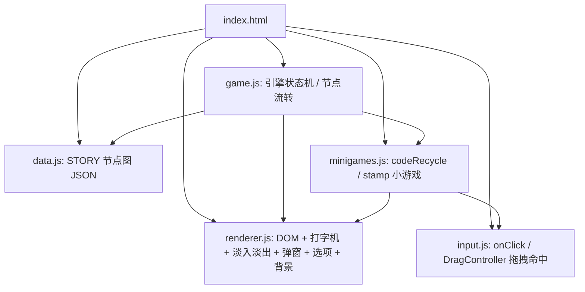

## 用户需求

使用 HTML + CSS + JavaScript（无构建工具，浏览器直接打开 index.html 运行）创建第一人称赛博朋克叙事游戏《密钥》的前端 Demo，本次仅实现"序章"内容，并完整实现序章中的两个交互小游戏。

## 产品概述

全屏沉浸式第一人称叙事体验。玩家通过底部对话框的打字机文本推进剧情，在关键节点通过鼠标框选、拖拽操作两个小游戏，最终以画面渐暗结束序章。视觉以 CSS 霓虹渐变与玻璃拟态渲染，并预留背景图接口。

## 核心功能

- 全屏沉浸式场景显示（第一人称视角氛围，含扫描线/霓虹光晕）
- 底部对话框打字机逐字显示，点击可快进/跳过
- 选项按钮位于对话框上方，霓虹描边风格，支持 hover 发光
- 鼠标框选 + 拖拽：代码圈选拖入右下角回收处理器小游戏（重复 2~3 轮后触发报错）
- 鼠标拖拽：经理办公室盖章小游戏（拖印章对准文件按下盖章，直至发现自己的裁员报告）
- 场景切换带渐入渐出（淡入淡出）效果
- 所有剧本数据以 JSON 形式存于 data.js
- 报错弹窗（"无法移动此文件…"）与系统提示条等 UI 组件
- 预留 .scene-bg 背景图接口，当前用 CSS 渲染，后续可替换为 assets/images 图片

## 技术栈

- HTML5：单页入口 index.html，定义全屏舞台容器与脚本加载顺序
- CSS3：全屏布局、霓虹渐变、扫描线动画、玻璃拟态弹窗、CSS transition 实现淡入淡出
- 原生 JavaScript（ES6，无构建/无打包）：分为 data / input / renderer / minigames / game 五个模块，通过全局变量衔接（按 script 顺序加载，规避 file:// 下 ES Module 的 CORS 限制）

## 实现方案

**策略**：数据驱动的节点图引擎。data.js 导出 `STORY` 节点图（含 `start` 与 `nodes` 字典），节点类型分为 `narration`（旁白/打字机）、`dialog`（对话+可选弹窗+选项）、`minigame`（交互小游戏）。game.js 作为状态机按 id 取节点并渲染，遇到 `minigame` 启动对应小游戏，完成后跳转 `onComplete`；场景切换统一先 fade-out 再换内容再 fade-in。

**关键技术决策**

- 节点图而非线性数组：序章虽线性，但后续五章存在 A/B/C 分支与多结局，节点图可无缝扩展分支，满足架构可扩展性。
- 新增 `minigames.js`：代码圈选与盖章逻辑包含较多 DOM + 拖拽代码，独立文件避免 game.js 膨胀，且复用 input 工具。
- 全局 script 顺序加载（data → input → renderer → minigames → game）：保证纯静态打开即可运行，无构建依赖。

**性能与可靠性**

- 打字机用单一 rAF 循环驱动，点击切换为"直接完成"态，避免多个 setInterval 计时器堆积。
- 拖拽 mousemove 经 rAF 节流，仅更新 `transform`（GPU 合成），命中检测缓存目标 `getBoundingClientRect`，避免连续重排抖动。
- 场景淡入淡出使用 `opacity` transition，不触发布局，开销极低。

## 实现要点

- 保持现有 game/ 下 4 个 js 与 css 骨架，新增 `js/minigames.js` 并按序加载。
- 背景切换用 CSS 类 + 变量；预留 `.scene-bg` 选择器，后续放入 assets/images 背景图即可覆盖 CSS 渲染。
- 打字机文本为中文，字体使用 CJK 字体（思源黑体 / PingFang SC）。
- 错误弹窗"无法移动此文件"为阻塞式，必须点击"确定"才推进剧情。

## 架构设计



## 目录结构

```
game/
├── index.html              # [MODIFY] 入口：viewport 全屏 meta、舞台容器 #stage、按序加载 5 个脚本
├── css/
│   └── style.css           # [MODIFY] 赛博朋克主题：.scene 场景层、.scene-bg 背景图钩子、扫描线、.dialog 对话框、.choices 选项区、.popup 弹窗、.sys-toast 系统提示、.minigame 覆盖层、#fade-overlay 淡入淡出
├── js/
│   ├── data.js             # [MODIFY] 导出 STORY 节点图（序章全部节点 JSON：narration/dialog/minigame），含 bg/text/popup/choices/next/minigame/onComplete 字段
│   ├── input.js            # [MODIFY] 鼠标工具：onClick 绑定、DragController（mousedown/move/up + 目标命中检测），供小游戏复用
│   ├── renderer.js         # [MODIFY] DOM 构建、打字机（rAF + 点击快进）、场景淡入淡出、弹窗、选项按钮、背景切换（含 .scene-bg 钩子）
│   ├── minigames.js        # [NEW] codeRecycle（代码框选拖拽回收）与 stamp（拖拽盖章）两个小游戏类，依赖 input 与 renderer，完成后回调
│   └── game.js             # [MODIFY] 引擎：加载 STORY、维护 currentNode、场景切换、启动/结束小游戏、选项跳转
└── assets/
    ├── images/             # 预留空目录：未来背景图放此，由 .scene-bg 引用
    └── sounds/             # 预留空目录
```

## 关键代码结构

```js
// data.js 节点契约（示意，非完整实现）
const STORY = {
  start: "p_intro",
  nodes: {
    p_intro:        { type: "narration", bg: "workstation-night", text: "…", next: "p_code_minigame" },
    p_code_minigame:{ type: "minigame",  bg: "workstation-night", minigame: "codeRecycle", intro: "…", onComplete: "p_error_popup" },
    p_error_popup:  { type: "dialog",    bg: "workstation-night", text: "…",
                      popup: { title: "系统报错", message: "无法移动此文件。该文件正在被其他进程使用。" },
                      choices: [{ text: "确定", next: "p_icon_appear" }] }
  }
};
```

## 设计风格

采用赛博朋克霓虹（Cyberpunk Neon）融合玻璃拟态（Glassmorphism）的第一人称沉浸式风格。深蓝黑渐变底色 + 青/品红/紫霓虹光晕 + 细微扫描线叠层，营造深夜办公、卧室与经理办公室的第一人称氛围。所有面板使用半透明毛玻璃质感，文字带霓虹辉光，按钮 hover 发光并有微动效，整体高级且具未来感。

## 页面区块设计（自上而下）

1. **场景层 .scene**：全屏 100vh 占满，CSS 深蓝黑径向/线性渐变 + 霓虹光斑 + 扫描线动画；预留 `.scene-bg` 背景图接口（当前为空，后续可覆盖）。不同场景通过切换类名改变色调氛围。
2. **系统提示条 .sys-toast**：顶部居中半透明玻璃条，显示"已连接：经理·张 HR-07 型义肢"等系统消息，淡入停留后淡出，不遮挡主视觉。
3. **选项按钮区 .choices**：位于对话框上方，霓虹描边按钮纵向排列，hover 发光、点击微缩放/波纹，选项来自节点 choices。
4. **对话框 .dialog**：底部固定玻璃拟态面板，含说话人标签、打字机正文、闪烁光标；点击面板区域可快进/跳过当前打字。
5. **中心弹窗 .popup**：报错/确认用居中玻璃弹窗，含标题、正文、确定按钮与半透明遮罩，阻塞式交互。
6. **小游戏覆盖层 .minigame**：覆盖场景层的交互层——代码屏（可鼠标框选代码行 + 右下角回收处理器）与盖章层（可拖拽印章 + 桌面文件目标），操作完成回调引擎。

所有区块响应式适配桌面全屏，过渡平滑，交互有微动效反馈。